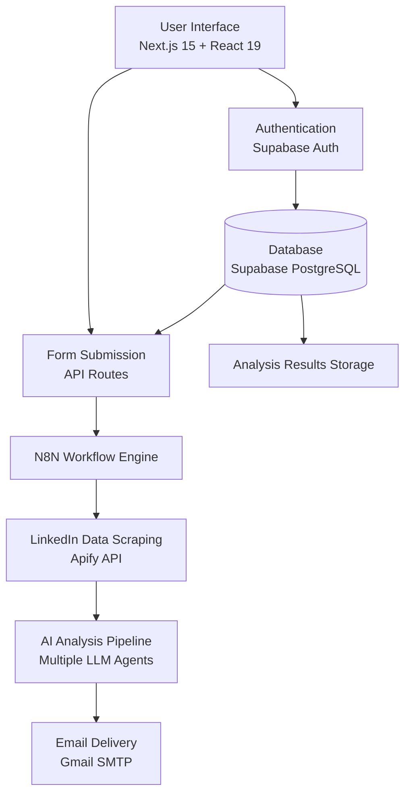
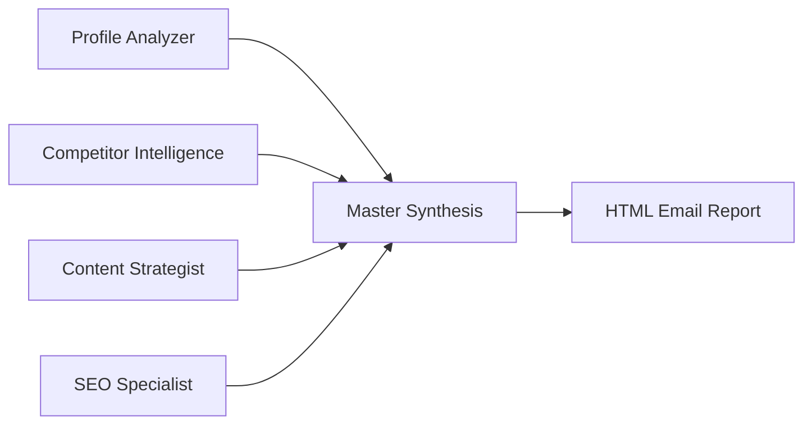

# LinkedIn Profile Optimizer

An AI-powered LinkedIn profile optimization platform that analyzes user profiles against competitor data to provide actionable recommendations for improving LinkedIn presence and professional branding.


## 🏗️ System Architecture

### High-Level Architecture



### Component Architecture

```
├── Frontend (Next.js)
│   ├── Authentication Layer
│   ├── Profile Analysis Form
│   ├── Results Display
│   └── Email Integration
├── Backend Services
│   ├── Supabase (Auth + Database)
│   ├── N8N Workflow Engine
│   └── External APIs (Apify, Gmail)
└── AI Processing Pipeline
    ├── Profile Analyzer Agent
    ├── Competitor Intelligence Agent
    ├── Content Strategist Agent
    ├── SEO Specialist Agent
    └── Master Synthesis Agent
```

### Data Flow

1. **User Authentication**: Email-based authentication via Supabase
2. **Profile Submission**: User submits LinkedIn URLs and target position
3. **Data Storage**: Request stored in Supabase with unique request ID
4. **Workflow Trigger**: N8N webhook receives request and initiates processing
5. **Data Scraping**: Apify API scrapes LinkedIn profiles (user + competitors)
6. **AI Analysis**: Multiple AI agents analyze and generate recommendations
7. **Result Synthesis**: Master agent combines all analyses into actionable report
8. **Email Delivery**: Formatted HTML report sent to user's email
9. **Status Updates**: Real-time status tracking in database

## 🔧 N8N Workflow Integration

The analysis is powered by a sophisticated N8N workflow with the following key components:

### Workflow Nodes

| Node | Purpose | Technology |
|------|---------|------------|
| **Webhook Trigger** | Receives analysis requests from frontend | N8N Webhook |
| **Input Validation** | Validates LinkedIn URLs and request data | Code Node |
| **LinkedIn Scraping** | Scrapes profile data using Apify API | HTTP Request + Wait Nodes |
| **Data Aggregation** | Combines user and competitor profile data | Code Node |
| **Agent Orchestration** | Manages multiple AI agents | Switch + Merge Nodes |
| **Result Formatting** | Creates final HTML email report | AI Agent + Code Node |
| **Email Delivery** | Sends results via Gmail SMTP | Gmail Node |

### AI Agent Pipeline

The workflow employs **5 specialized AI agents**:

1. **Profile Analyzer Agent**
   - Analyzes user's current profile
   - Identifies gaps and weaknesses
   - Provides specific improvement recommendations

2. **Competitor Intelligence Agent**
   - Analyzes competitor profiles
   - Extracts best practices and patterns
   - Identifies competitive advantages

3. **Content Strategist Agent**
   - Develops compelling messaging and positioning
   - Creates optimized profile content
   - Generates content strategy recommendations

4. **SEO Specialist Agent**
   - Optimizes content for LinkedIn discoverability
   - Provides keyword and hashtag strategies
   - Enhances search rankings

5. **Master Synthesis Agent**
   - Combines all agent outputs
   - Eliminates redundancy
   - Creates final actionable blueprint

### Agent Communication Flow



## 🗄️ Database Schema

### Tables

#### `users`
```sql
CREATE TABLE users (
  id UUID PRIMARY KEY DEFAULT gen_random_uuid(),
  email VARCHAR(255) UNIQUE NOT NULL,
  created_at TIMESTAMPTZ DEFAULT NOW(),
  last_login TIMESTAMPTZ
);
```

#### `analysis_requests`
```sql
CREATE TABLE analysis_requests (
  id UUID PRIMARY KEY DEFAULT gen_random_uuid(),
  user_id UUID REFERENCES users(id),
  request_id VARCHAR(255) UNIQUE NOT NULL,
  user_linkedin_url TEXT NOT NULL,
  competitor_urls TEXT[] NOT NULL,
  target_position TEXT NOT NULL,
  status VARCHAR(50) DEFAULT 'processing',
  created_at TIMESTAMPTZ DEFAULT NOW(),
  completed_at TIMESTAMPTZ
);
```

#### `analysis_results`
```sql
CREATE TABLE analysis_results (
  id UUID PRIMARY KEY DEFAULT gen_random_uuid(),
  request_id VARCHAR(255) REFERENCES analysis_requests(request_id),
  user_id UUID REFERENCES users(id),
  result_data JSONB NOT NULL,
  created_at TIMESTAMPTZ DEFAULT NOW()
);
```

## 🔌 API Integrations

### External APIs

#### Apify LinkedIn Scraper
- **Endpoint**: `https://api.apify.com/v2/acts/dev_fusion~linkedin-profile-scraper/runs`
- **Purpose**: Scrapes LinkedIn profile data
- **Data Collected**: Profile info, experience, skills, education, certifications
- **Authentication**: API token-based

#### N8N Webhook
- **Endpoint**: `https://n8n.tebita.com/webhook/c296bc6a-427e-454d-a1da-4af6c894df69`
- **Purpose**: Triggers AI analysis workflow
- **Data Format**: JSON with profile URLs and metadata

#### Gmail SMTP
- **Purpose**: Email delivery for analysis results
- **Authentication**: OAuth 2.0
- **Content**: HTML-formatted reports

### Internal APIs

#### Authentication Endpoints
- **Login**: Email-based authentication via Supabase
- **Session Management**: Automatic session handling with localStorage

#### Analysis Submission
- **Method**: POST to N8N webhook
- **Data**: User profile URL, competitor URLs, target position
- **Response**: Request ID for tracking

## 🛠️ Technology Stack

### Frontend
- **Framework**: Next.js 15 with App Router
- **Language**: TypeScript
- **Styling**: Tailwind CSS
- **UI Components**: React 19 + Custom Components
- **Animations**: Framer Motion
- **Icons**: Lucide React

### Backend & Database
- **Database**: Supabase PostgreSQL
- **Authentication**: Supabase Auth
- **Workflow Engine**: N8N
- **Email Service**: Gmail SMTP

### AI & External Services
- **AI Models**: OpenAI GPT-4 (via N8N LangChain)
- **Data Scraping**: Apify API
- **Hosting**: Vercel (frontend)

## 🚀 Getting Started

### Prerequisites
- Node.js 18+
- npm/yarn/pnpm
- Supabase account
- N8N instance
- Gmail account for email delivery

### Environment Variables

Create a `.env.local` file:

```env
# Supabase Configuration
NEXT_PUBLIC_SUPABASE_URL=your_supabase_url
NEXT_PUBLIC_SUPABASE_ANON_KEY=your_supabase_anon_key

# N8N Configuration
NEXT_PUBLIC_N8N_WEBHOOK_URL=your_n8n_webhook_url

# External APIs
APIFY_API_TOKEN=your_apify_token
```

### Installation

1. **Clone the repository**
```bash
git clone <repository-url>
cd linkedin-optimizer
```

2. **Install dependencies**
```bash
npm install
```

3. **Set up Supabase**
```bash
# Create tables using the schema provided above
# Configure authentication settings
```

4. **Configure N8N workflow**
```bash
# Import the provided workflow JSON
# Configure API keys and endpoints
# Set up Gmail integration
```

5. **Run development server**
```bash
npm run dev
```

Open [http://localhost:3000](http://localhost:3000) to view the application.

## 📧 Email Report Structure

The final analysis report is delivered via email with the following structure:

### Email Sections
1. **Executive Summary**: Key findings and competitive advantage
2. **Profile Optimization**: Before/after recommendations
3. **Implementation Plan**: 3-phase action plan
4. **Success Metrics**: KPIs for measuring improvement
5. **Action Items**: Specific, actionable next steps

### HTML Email Features
- **Responsive Design**: Mobile-friendly layout
- **Dark Theme**: Glassmorphism design with dark slate background
- **Visual Hierarchy**: Clear headings and organized sections
- **Interactive Elements**: Properly formatted for email clients
- **Professional Styling**: Consistent branding and typography

## 🔒 Security & Privacy

### Data Handling
- **User Data**: Email addresses stored securely in Supabase
- **LinkedIn URLs**: Processed through secure API calls
- **Analysis Results**: Encrypted storage and secure email delivery

### API Security
- **Token Management**: API keys stored as environment variables
- **Request Validation**: Input sanitization and URL validation
- **Rate Limiting**: Implemented at N8N workflow level

## 🐛 Troubleshooting

### Common Issues

#### Authentication Issues
```bash
# Check Supabase connection
console.log('Supabase URL:', process.env.NEXT_PUBLIC_SUPABASE_URL)
console.log('Supabase Key:', process.env.NEXT_PUBLIC_SUPABASE_ANON_KEY)
```

#### N8N Workflow Failures
- Verify webhook URL is accessible
- Check API token validity
- Monitor workflow execution logs
- Ensure Gmail integration is properly configured

#### Email Delivery Issues
- Verify Gmail SMTP settings
- Check OAuth 2.0 configuration
- Monitor spam folder for test emails
- Validate HTML email formatting

#### Database Issues
```sql
-- Check table structure
SELECT * FROM information_schema.tables WHERE table_name = 'users';

-- Verify user data
SELECT * FROM users LIMIT 5;

-- Check analysis requests
SELECT status, COUNT(*) FROM analysis_requests GROUP BY status;
```

### Debug Mode
Enable debug mode by setting:
```env
DEBUG=true
NODE_ENV=development
```

## 📊 Monitoring & Analytics

### Key Metrics
- **User Registration Rate**: New users per day
- **Analysis Completion Rate**: Successful vs failed analyses
- **Email Delivery Success**: Successful email sends
- **Average Processing Time**: Time from submission to email delivery

### Logging
- **Frontend Logs**: Browser console and Vercel logs
- **N8N Logs**: Workflow execution logs
- **Database Logs**: Supabase query logs
- **Email Logs**: Gmail delivery logs

## 🚢 Deployment

### Vercel Deployment

1. **Connect Repository**
```bash
# Push code to GitHub/GitLab
git add .
git commit -m "Deploy LinkedIn Optimizer"
git push origin main
```

2. **Vercel Configuration**
```json
{
  "buildCommand": "npm run build",
  "devCommand": "npm run dev",
  "installCommand": "npm install",
  "env": {
    "NEXT_PUBLIC_SUPABASE_URL": "@supabase-url",
    "NEXT_PUBLIC_SUPABASE_ANON_KEY": "@supabase-anon-key",
    "NEXT_PUBLIC_N8N_WEBHOOK_URL": "@n8n-webhook-url"
  }
}
```

3. **Environment Variables**
- Set all required environment variables in Vercel dashboard
- Configure build settings for Next.js 15
- Set up domain and SSL certificates

### N8N Deployment
- Deploy N8N instance (self-hosted or cloud)
- Import workflow configuration
- Set up API keys and integrations
- Configure webhook endpoints

### Database Setup
- Create Supabase project
- Run database migrations
- Configure authentication settings
- Set up RLS policies

## 🤝 Contributing

1. Fork the repository
2. Create a feature branch (`git checkout -b feature/amazing-feature`)
3. Commit your changes (`git commit -m 'Add amazing feature'`)
4. Push to the branch (`git push origin feature/amazing-feature`)
5. Open a Pull Request

### Development Guidelines
- Follow TypeScript best practices
- Use ESLint configuration
- Maintain consistent code style
- Add tests for new features
- Update documentation

## 📄 License

This project is licensed under the MIT License - see the [LICENSE](LICENSE) file for details.

## 📞 Support

For support and questions:
- Create an issue in the repository
- Check the troubleshooting section
- Review N8N workflow documentation
- Contact the development team

---

**Built with ❤️ using Next.js, Supabase, and N8N**
